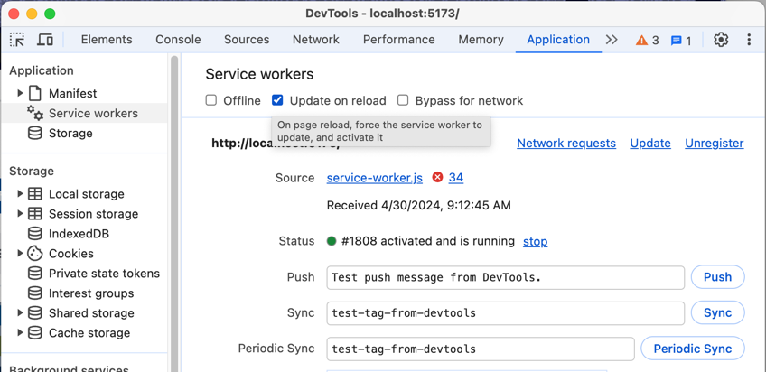
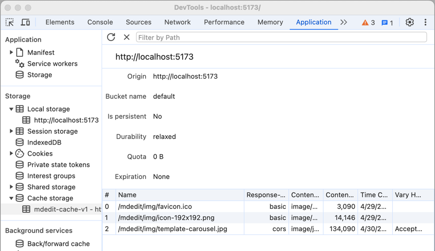

# USDS Site Editor

This tool addresses the error-prone part of adding or editing posts on the Jekyll Frontmatter website,
editing the yaml header and markdown content using WYSIWYG editor and guided forms modals.

A static-html, front-end React client to edit markdown and have it look visually similar to how it appears on the final
site.

"Serverless" in the sense that it is running locally in browser with no server interaction required.

Results of edits can be saved to the local device as a zip file, including any images used by the markdown.

Site is github pages deployed here: https://usds.github.io/website-content-editor/


1. Load/save data
2. Switch between WYSIWYG and markdown text editor mode.
3. Edit page metadata (Front Matter header) via a modal dialog
4. Read only preview of metadata. Must be edited in modal or as text.
5. The rich editor section

## What's working

- Heavily leverages the open source project: [MDXEditor](https://github.com/mdx-editor/editor)
- Customizes the Frontmatter plugin with a dialog for editing our variables.
- Loads stylesheets/fonts/image from USDS's staging site to make it visually consistent with final look-and-feel.
- Stores uploaded photos into cache and uses a service worker layer to display them in the editor
- Downloads zip file of the markdown and images ready to submitted (all without a server)
- Can "upload" some existing markdown to make quick edits.

# Developers
1. To deploy, merge `main` branch into `gh-pages`. [See branches](https://github.com/usds/website-content-editor/branches)
1. The [deploy action](https://github.com/usds/website-content-editor/actions) will automatically run.
1. Go to the github hosted website: https://usds.github.io/website-content-editor/

## What's still to-do:
- Unit tests of some kind
- Handle different template types
- Create a better Quote component
- Link component showing offsite links correctly
- Help pages for how to merge in markdown edits back into website
- Need to reorganize code. Lots of things should be separated out into components.

## Build
The build scripts are all standard Vite stuff:
- `dev` Builds + watches + runs the site in development mode.
- `build` Builds `production` mode into the `dist/` directory
- `preview` Starts up a webserver pointing to `dist/` directory to check release builds
- `update` Is the `yarn` command to update dependencies

### Some build exception - because... of course
The service-worker is a non-standard. The normal usage of a service-worker is to provide an offline app.

OUR usage is to allow embedded images in the rich editor to function without a server.

Build-wise, the service worker script is standard `.js` and the two files
are copied directly into the `dist/` directory. Because `registerSW.js`
and `service-worker.js` are standard javascript, they are **not** transpiled
and they don't import anything. So, some constants associated with the cache
are duplicated and need to kept in sync.

## Security
Site is 100% static. All content is stored in the browser's cache and localstorage.


### Content-Security-Policy
Since it's running on github.io, we cannot set a CSP http header.
The next best thing is a `<meta>` header.

Vite dev mode uses hot reloading, which uses unsafe `eval`, so for
localdev, the CSP is disabled.

Enable/disable is done via the `.env.development` `.env.production` files.

Here's the current CSP:
```html
<meta http-equiv="Content-Security-Policy" 
      content="
        base-uri 'self';
        default-src 'self';
        script-src 'self';
        style-src 'self' https://usds.github.io/ https://usds.gov/ 'unsafe-inline'; 
        img-src 'self' https: data: blob:; 
        font-src 'self' https://usds.github.io/ https://usds.gov/ https://*.gov/; 
        form-action 'none';
        worker-src 'self' https: data: blob:;">
```

#### csp scripting
The most important items are:
```
default-src 'self';
script-src 'self';
```
These lock down scripting to just the site and prevents `eval` injections.

#### csp style
```
style-src 'self' https://usds.github.io/ https://usds.gov/ 'unsafe-inline';
```
The tool loads style scripts from website staging.

`unsafe-inline` is required because some of the 3rd party tools dynamically sets `style=` attribute.

#### csp images
```
img-src 'self' https: data: blob:;
```
The `https:` allows images to be loaded from anywhere. This allows the service-worker to 
cache images from sites that are pasted into the WYSIWYG editor.

The service worker transparently passes on all requests that are not images.

## Build breakage
> ⚠️ **This package as well as MDXEditor both use lexical and other libraries; therefore, both
must use the same VERSION or you'll get strange typescript errors / runtime errors!**

To make this breakage more explicit, the yarn locks in the same version as MDXEdtor

``` json5
  "peerDependencies": {
    "react": "^18.2.0",
    "react-dom": "^18.2.0"
  },
  "resolutions": {
    "@lexical/react": "^0.14.3",
    "@mdxeditor/gurx": "^1.1.3",
    "downshift": "^7.6.0",
    "lexical": "^0.14.3",
    "mdast-util-from-markdown": "^2.0.0",
    "mdast-util-frontmatter": "^2.0.1",
    "mdast-util-gfm": "^3.0.0",
    "micromark-extension-gfm": "^3.0.0"
  },
```

If the packages ever get out of sync, you'll start getting like typescript compile warnings like this:
> `"warning "@mdxeditor/editor > @lexical/utils > @lexical/table@0.12.6" has incorrect peer dependency "lexical@0.12.6"."`

The package from MDXEditor that determines which versions to use (aka our package must stay in sync with)
can be found here: 
https://github.com/mdx-editor/editor/blob/main/package.json

## Debugging

In chrome debugger, the Applications tab shows the service workers features.

You should check the "Update on reload"


The current list of cached images can be viewed under Cache Storage

